## 函数
### 一元单值函数

给定两个变量x, y和数集D_f, C_f,
\\若对于每一个x\in D_f,都能按照法则f找到对应的y \in C_f, 
\\则称y为x的\textbf{函数(function)},x为\textbf{自变量(independent variable)},
\\y为\textbf{因变量(dependent variable)},
\\数集D_f为该函数的\textbf{定义域(domain)},C_f为该函数的\textbf{上域(codomain)},
\\集合R_f=\set {f(x)|x\in D_f}为该函数的\textbf{值域(range)}
\\容易注意到,R_f \subset C_f, 即值域是上域的子集

简单来说,一个$x_0$只能找到一个$y$, 而一个y可能对应多个$y0, y1...$
我们在微积分这门课程里研究的函数主要为一元或多元的单值函数.

$example1-1.$
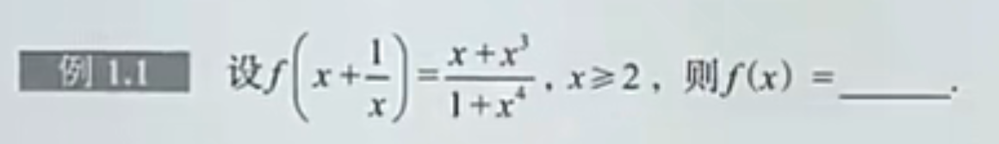

solution.
\\首先,x\ge 2时x+\frac {1}{x}是严格单调的,所以可以建立一个双射(换元)令t=x+\frac{1}{x},t\ge \frac{5}{2},
\\此时tx = 1+x^2, x+x^3 = x(1+x^2) = x \cdot tx = tx^2,分子处理完毕.
\\再考虑处理分母,对t=x+\frac{1}{x}两边同时平方得到t^2 = x^2 + 2 + \frac{1}{x^2}, \\于是t^2x^2-2x^2=x^4+1,分母处理完毕.
\\最后f(t)=\frac{tx^2}{t^2x^2-2x^2},由于x\neq 0, 可以约掉,f(t)=\frac{t}{t^2-2}.
\\答案为
\\ f(x)=\frac{x}{x^2-2}, x\ge \frac{5}{2}.

为什么能做这个换元?首先考虑题目这个条件是怎么来的:实际上是由$f(x)=...(关于x的函数)$换元令$x=x'+\frac{1}{x'}$得来的,而这个换元在$x'\ge 2$时单调,代表我们可以逆向解出结果.

$example1-2.$
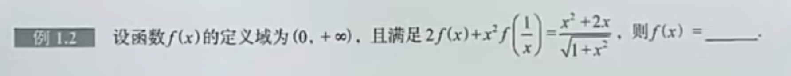

solution.
\\2f(x) + x^2f(\frac{1}{x})= \frac{x^2+2x}{\sqrt{1+x^2}},\space (1)
\\由于x\gt 0时\frac{1}{x}严格单调,可以做倒代换,即用\frac{1}{x}代替x
\\2f(\frac{1}{x}) + \frac{1}{x^2}f(x)= \frac{\frac{1}{x^2}+\frac{2}{x}}{\sqrt {1+\frac{1}{x^2}}}
\\整理得到
\\2f(x)+4x^2f(\frac{1}{x})=\frac{2x+4x^2}{\sqrt{1+x^2}},\space (2)
\\联立(1)(2),得到
\\ f(x)=\frac{x}{\sqrt{x^2+1}}, x>0.

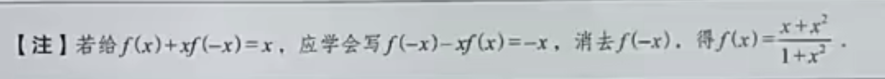

### 反函数

对于函数f(x),定义域为D_f,值域为R_f,
\\如果对于每一个y\in R_f都能找到\textbf{唯一的}x使得y=f(x),
\\则此时x也是y的函数,记作x=f^{-1}(y).
\\(这时x是因变量,y是自变量,为了统一自变量与因变量的符号,
\\有时会交换x与y的位置,记作y=f^{-1}(x))
\\(注意x=f^{-1}(y)与y=f(x)等价,而y=f^{-1}(x)与y=f(x)不等价)
\\ f^{-1}这个对应法则称为f的\textbf{反函数}.
\\容易注意到f与f^{-1}满足f(f^{-1}(x)) = f^{-1}(f(x))=x

:::tip[提示]

\\1. 严格单调函数必有反函数(反过来不一定成立,即反函数不一定是严格单调函数)
\\2. 函数x=f^{-1}(y)与y=f(x)图像完全重合,
\\而函数y=f^{-1}(x)与y=f(x)图像关于y=x对称

:::
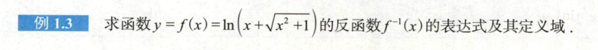

solution.
\\首先,这是一个奇函数,且在定义域上单调,值域为\mathbb{R},所以其反函数的定义域为\mathbb{R}
\\目标:通过方程y=\ln{(x+\sqrt{x^2+1})}反解出x.
\\两边取指数,得
\\e^y = x + \sqrt{1+x^2},\space(1)
\\右边这个式子可以分子有理化,
\\e^y = \frac{1}{\sqrt{1+x^2}-x}
\\即
\\ \frac{1}{e^y}=\sqrt{1+x^2}-x,\space(2)
\\联立(1)(2)得
\\x=\frac{e^y-e^{-y}}{2}
\\最后答案为
\\f^{-1}(x)=\frac{e^x-e^{-x}}{2},x\in \mathbb R

:::tip[双曲三角函数的性质]

1.函数f(x) = \frac{e^x-e^{-x}}{2}称为双曲正弦函数,记作f(x)=\sinh x,图像为

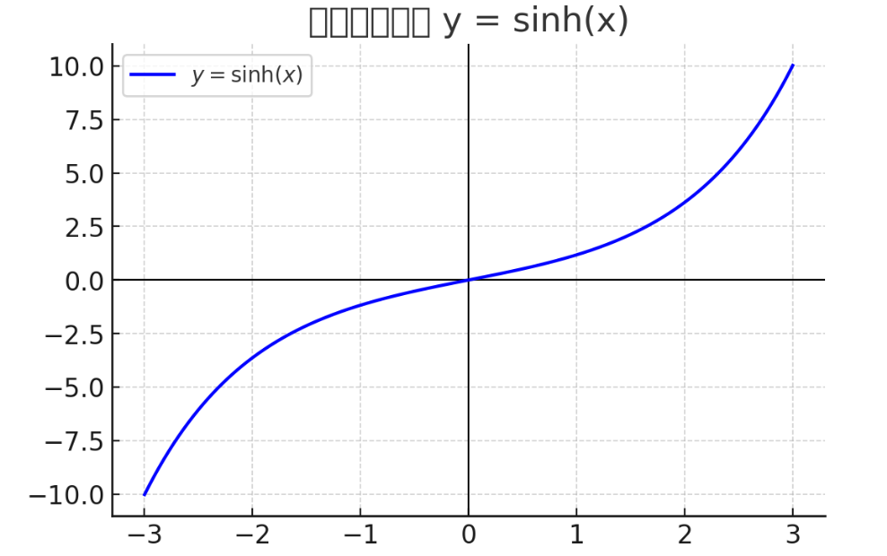

2.函数f(x) = \ln{(x+\sqrt{x^2+1})}称为反双曲正弦函数,记作f(x)=\operatorname{asinh} x,图像为

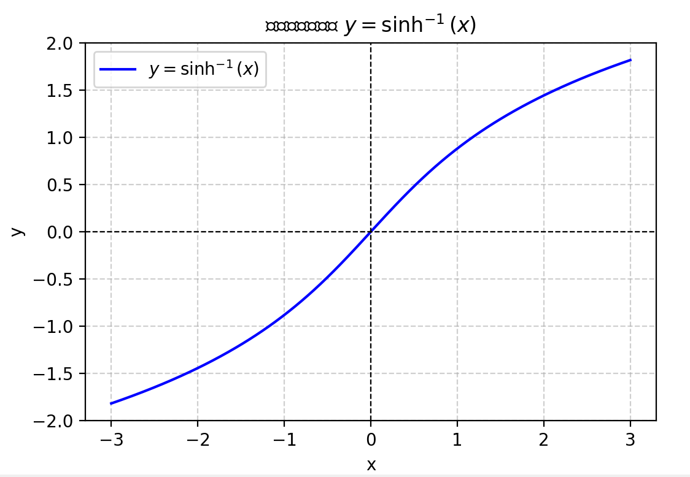

3.函数f(x) = \frac{e^x-e^{-x}}{2}称为双曲余弦函数,记作f(x)=\cosh x,图像为

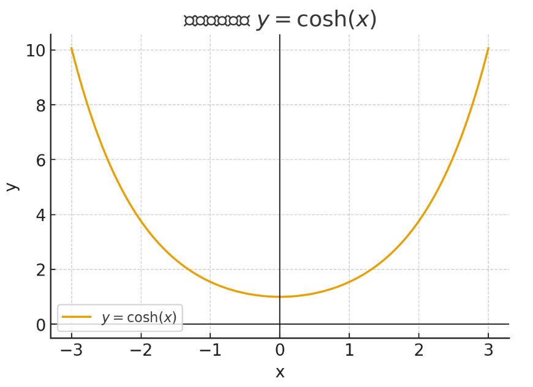

4.x\sim \operatorname{asinh} x\sim\sinh x, x\rightarrow 0
\\5.(\operatorname{asinh} x)'=\frac{1}{\sqrt{x^2+1}}, 
\\ \int{\frac{1}{\sqrt{x^2+1}}}\, \mathrm{d}x=\operatorname{asinh} x + C.
\\6.\sinh x与\operatorname{asinh} x是奇函数,\cosh x是偶函数
\\7.\cosh^2 x - \sinh^2 x = 1
\\8.(\sinh x)' = \cosh x, (\cosh x)' = \sinh x.

:::

### 复合函数

设函数y=f(u), 定义域为D_f,
\\函数u=g(x), 定义域为D_g, 值域为R_g
\\且R_u\subset D_f
\\则y=f\circ g(x)=f(g(x))也是一个函数,
\\称为f与g的\textbf{复合函数(composite function)},
\\其定义域为D_g.

$example1-4$
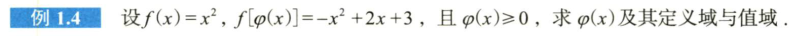

\varphi (x) = f^{-1}(-x^2+2x+3)
\\由于\varphi (x) \ge 0,\varphi (x)=\sqrt{-x^2+2x+3}, x\in [-1,3]
\\值域为[0,2]

$example1-5$
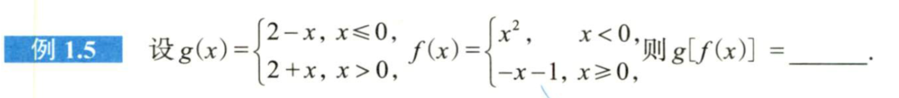

solution.
显然在(-\infty, 0)上f(x)>0,[0, +\infty) 上f(x)\le 0.
\\那么(-\infty, 0)上g[f(x)]=2+x^2,
\\ [0, +\infty)上g[f(x)]=x+3.

### 隐函数

对于方程F(x,y)=0,与某个区间D,若对于任意x\in D有唯一y与其对应,
\\则称方程F(x,y)=0在该区间上确定了一个函数y=y(x),
\\称为\textbf{隐函数(implicit function)}

:::note[注意]
1. 部分隐函数可显化,但更多的是不易显化的隐函数
2. 部分隐函数的求值需要集中注意力,比如求
$$\ln y - \frac{x}{y} + x = 0在x=2处的值$$
,需要注意到$y=1$时该方程成立
:::

### 函数的特性
#### 有界性

设函数f的定义域为D_f,在某区间I\subset D_f上, 若
\\\exist M>0, 使\forall x\in I,|f(x)|\le M,则称f(x)在I上\textbf{有界(bounded)},
\\否则称f(x)在I上\textbf{无界(unbounded)}

若\exist M>0, 使\forall x\in I,f(x)\le M,则称f(x)在I上有上界,
\\若\exist M<0, 使\forall x\in I,f(x)\ge M,则称f(x)在I上有下界

$example1-6$
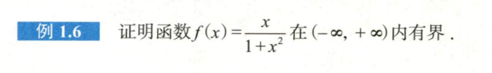

proof.
\\(1)x\in[0,+\infty)时,f(x)\ge0,
\\x<1+x^2,故f(x)<1.
\\(2)x\in (-\infty, 0)时,f(x)\le0,
\\x<1+x^2,故f(x)>-1.
\\即取M=1,\forall x\in I,|f(x)|\le M.
\\Q.E.D.

#### 单调性

设函数f的定义域为D_f,在某区间I\subset D_f上, 若:
\\\cdotp\forall x_1,x_2\in I且x_1<x_2,都有f(x_1)\le f(x_2), 则称f(x)在I上\textbf{单调增},或\textbf{单调不减}.
\\\cdotp\forall x_1,x_2\in I且x_1<x_2,都有f(x_1)< f(x_2), 则称f(x)在I上\textbf{严格单调增}.
\\\cdotp\forall x_1,x_2\in I且x_1<x_2,都有f(x_1)\ge f(x_2), 则称f(x)在I上\textbf{单调减},或\textbf{单调不增}.
\\\cdotp\forall x_1,x_2\in I且x_1<x_2,都有f(x_1)> f(x_2), 则称f(x)在I上\textbf{严格单调减}.

$example1-7$
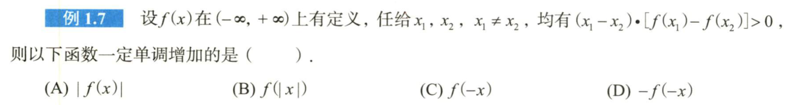

solution.
\\显然选D,这是f(x)严格单调增的等价形式.则-f(-x)必定单调增.

#### 奇偶性

设函数f的定义域为D_f,若D_f关于原点对称,且:
\\\cdotp \forall x\in D_f, f(x)=f(-x),则称f(x)为\textbf{偶函数(even function)}
\\\cdotp \forall x\in D_f, f(x)=-f(-x),则称f(x)为\textbf{奇函数(odd function)}

:::tip[关于奇偶函数的一些性质]

1.奇函数图像关于原点对称,偶函数图像关于y轴对称
\\2.任何函数(只要定义域允许)都可以写成一个奇函数与一个偶函数的和,如下
\\对于函数f(x),令g(x)=\frac{f(x)+f(-x)}{2},h(x)=\frac{f(x)-f(-x)}{2},
\\则g(x)是一个偶函数,h(x)是一个奇函数,f(x)=g(x)+h(x).
\\3.奇函数的导数是偶函数,偶函数的导数是奇函数,积分同理.

:::

$example1-8$
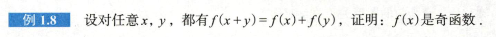

proof.
\\先令x=y=0有f(0)=2f(0),即f(0)=0,
\\再令y=-x,有f(0)=0=f(x)+f(-x).
\\即\forall x\in \mathbb{R},f(x)=-f(-x).
\\Q.E.D.

#### 周期性

设函数f的定义域为D_f,若\exist T > 0,使得\forall x\in D_f,
\\都有x+T\in D_f,且f(x)=f(x+T),
\\则称f(x)为\textbf{周期函数(periodic function)}, 
T称为f(x)的周期.

:::note[一些结论]

1.若f(x)以T为周期,则f(ax+b)以\frac{T}{|a|}为周期.
\\2.若g(x)是周期函数,则f(g(x))也是周期函数.
\\3.若f(x)以T为周期,则f'(x)也以T为周期.
\\4.若f(x)以T为周期,则只有当\int _0^Tf(x) \, \mathrm{d}x=0时,\int _0^xf(t) \, \mathrm{d}t才以T为周期.

:::

$example1-9$
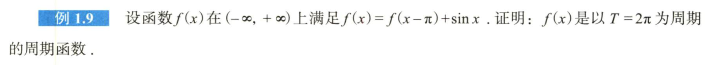

proof.
\\f(x+\pi) = f(x)-\sin x,f(x+2\pi)=f(x+\pi)+\sin x.
\\则f(x+2\pi)=f(x).
\\Q.E.D.

### 常见函数
