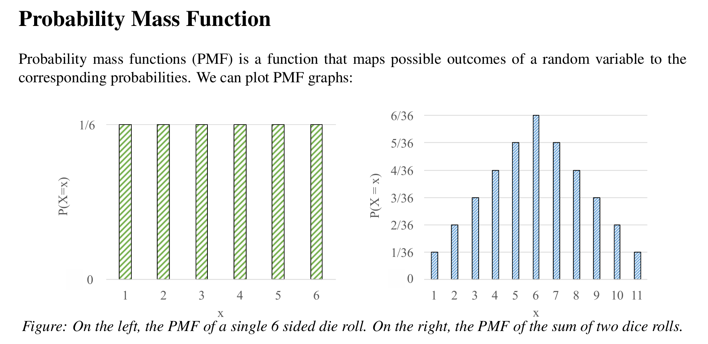

:::note[目录]
1. 事件和样本空间
2. 概率论公理
3. 条件概率
4. 贝叶斯理论
5. 独立事件
6. 随机变量, 期望
:::

## 事件和样本空间
### 样本空间
试验的样本空间$S$是试验的所有可能结果组成的集合.

:::tip[试验对应的样本空间]
1. 抛硬币: $S = \set{\text{正面}, \text{反面}}$
2. 同时抛两枚硬币: $S = \set{\text{(正, 正)}, \text{(正, 反)}, \text{(反, 正)}, \text{(反, 反)}}$
:::

### 事件与事件空间
1. 事件: 某个谓词$H(x), x\in S$. $H(x)$为真时我们称事件$H$"发生", 否则称事件$H$"不发生".
2. 事件空间: 某个集合$H$, $H = \set{x | x\in S, H(x)}$, 即使事件发生的结果组成的集合.

:::tip[事件对应的事件空间]
1. $H =$ "硬币正面朝上": $E = \set{\text{正面}}$
2. 试验为"同时抛两枚硬币", $H = \text{"正面朝上的硬币数大于等于一"}: E = \set{\text{(正, 正)}, \text{(正, 反)}, \text{(反, 正)}}$
:::

## 概率论公理
### 概率
概率是频率的极限.

设$n$为总试验次数, $n(H)$为$n$次试验中使事件$H$发生的试验次数. 

可以定义事件$H$发生的概率$P(H)$.

$$
P(H) = \lim _{n\rightarrow \infty}\frac{n(H)}{n}
$$

### 概率论公理
概率可以进行公理化定义.
1. $0\le P(H) \le 1$.
2. $P(S) = 1$
3. 若$E \cap F = \emptyset, P(E) + P(F) = P(E\cup F)$.

:::tip[概率论定理]
以下是一些可以被证明的定理:
1. $P(S\backslash E) = 1 - P(E)$
2. 若$E\subset F, P(E) \le P(F)$.
3. $P(E\cup F) = P(E) + P(F) - P(E\cap F)$.
4. 
   \[
P\left( \bigcup_{i=1}^n E_i \right)
= \sum_{r=1}^n (-1)^{\,r+1} 
  \sum_{1 \le i_1 < i_2 < \cdots < i_r \le n} 
  P\!\bigl(E_{i_1} E_{i_2} \cdots E_{i_r}\bigr)
\]. 容斥原理的拓展.
:::

### 古典概型
样本空间$S$有限, 且每个单位事件(有且仅有1个元素能够使其发生的事件)的概率相等. 比如抛硬币, 掷骰子.

此时事件$E$的概率:

$$
P(E) = \frac{|E|}{|S|}
$$

## 条件概率
$P(E|F)$表示在F发生的给定条件下, E发生的概率.
$$P(E|F) = \frac{P(EF)}{P(F)}$$.
:::tip[链式法则]
$$
P(EF) = P(E|F)P(F)
$$

$$
P(E_1E_2E_3\cdots E_n) = P(E_1)P(E_2|E_1)P(E_3|E_1E_2)\cdots P(E_n|E_1E_2E_3\cdots E_{n - 1})
$$
:::

## 贝叶斯理论
### 贝叶斯定理
$$
P(F|E) = \frac{P(F)P(E|F)}{P(E)}
$$
$$
P(F|E) = \frac{P(F)P(E|F)}{P(F)P(E|F) + P(\bar F)P(E|\bar F)}
$$

### 贝叶斯理论
贝叶斯理论的本质: 后验概率正比于先验概率与似然(观察到E的可能性)的乘积.

先验概率对应$P(E|F)$, 是我们在某信息下对某事发生概率的主观信念. 
似然对应$P(F)$, 是我们观测到某信息的客观机会. 
后验概率对应$P(F|E)$, 是我们在主观信念和客观信息下的理性推断. 

从由因到果(先验)的推理, 转变成由果推因(后验)的推断, 这是贝叶斯理论的精华所在.

## 独立事件
- 称事件$E$与$F$独立, 当且仅当:
$$
P(EF) = P(E)P(F)
\\\text{其等价形式为}
\\P(E|F) = P(E)
$$

- 称事件$E,F,G$独立, 当且仅当:
$$
P(EFG) = P(E)P(F)P(G)
\\P(EF) = P(E)P(F)
\\P(EG) = P(E)P(G)
\\P(FG) = P(F)P(G)
$$
全部成立.

若$E$与$F$独立, 则$\bar E$与$F$也独立..., 等等.
### 条件独立
称事件$E$与事件$F$在$G$的条件下独立, 当且仅当:
$$
P(EF|G) = P(E|G)P(F|G)
\\\text{其等价形式为}
\\P(E|FG) = P(E|G)
$$

## 随机变量和期望
### 随机变量
一个随机变量$X$是从随机试验结果到实数的函数.

比如一个随机试验为同时抛三枚硬币.

其样本空间$$S = \set{(H, H, H),(H, H, T),(H, T, H),(T, H, H)\\(H, T, T),(T, H, T),(T, T, H),(T, T, T)}$$

此处用$H$代指正面, $T$代指反面.

建立随机变量$Y$作为正面朝上的个数.

我们有$Y(H, H, H) = 3, Y(H, T, H) = 2$等.

离散型随机变量的每个取值可以对应一个概率. 该概率为所有使随机变量取该值的事件概率总和. 从取值到概率可以建立一个函数. 

### 概率质量函数(PMF, probability mass function)

$P(Y = x)$表示事件$Y = x$的概率.称为概率质量函数. 

PMF常用柱状图表示:

### 累计分布函数(CDF, Cumulative Distribution Function)
随机变量$X$的累计分布函数定义为:
$$F(a) = P(X \le a), a\in R$$

### 期望
随机变量$X$的期望定义为:
$$E[X] = \Sigma_{i:P(X=i) > 0} iP(X = i)$$

期望具有线性性.
$$
E[aX + b] = aE[x] + b.
$$

### 指示器随机变量
事件$A$的指示器随机变量$I$的定义为:
- 当$A$发生, $I = 1$
- 当$A$不发生, $I = 0$
容易注意到$P(I = 1) = P(A) = E[I]$