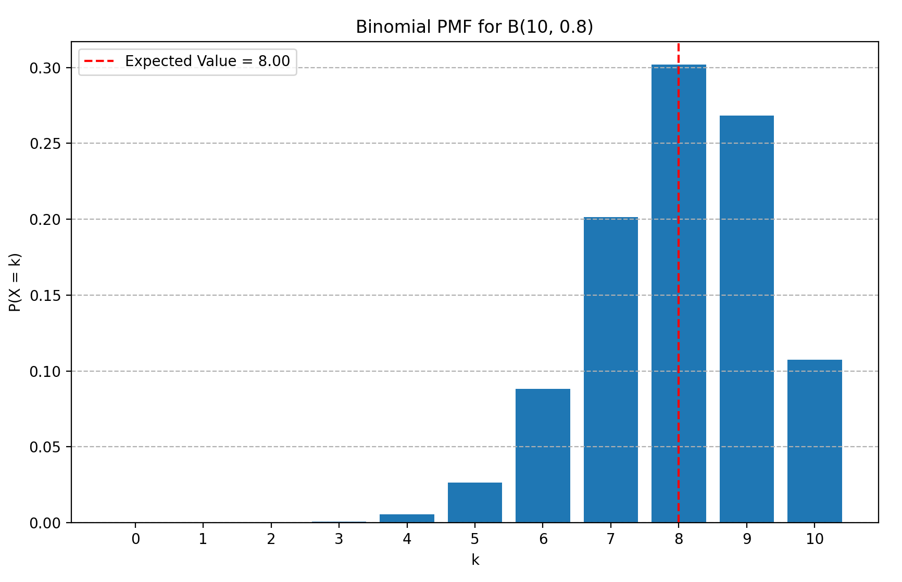
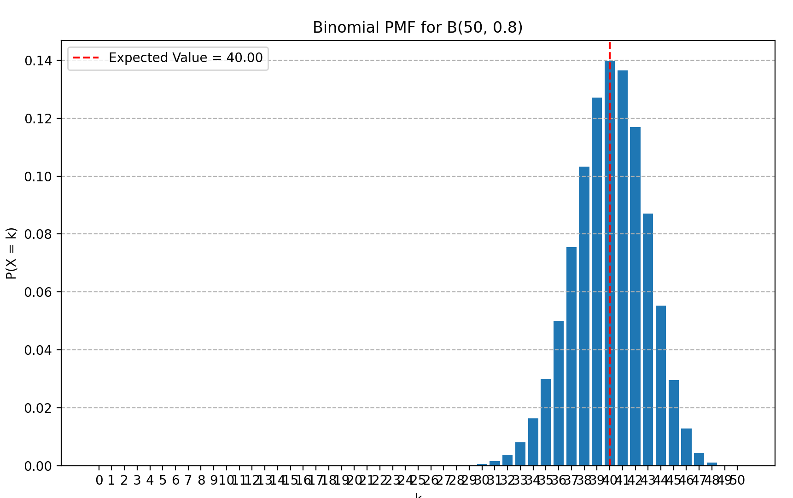
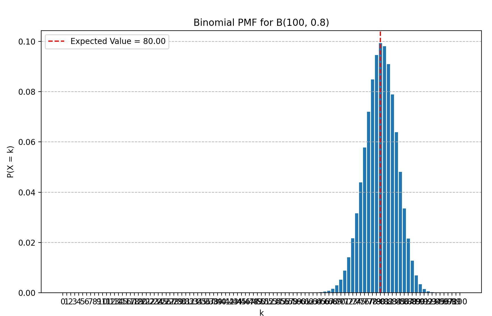
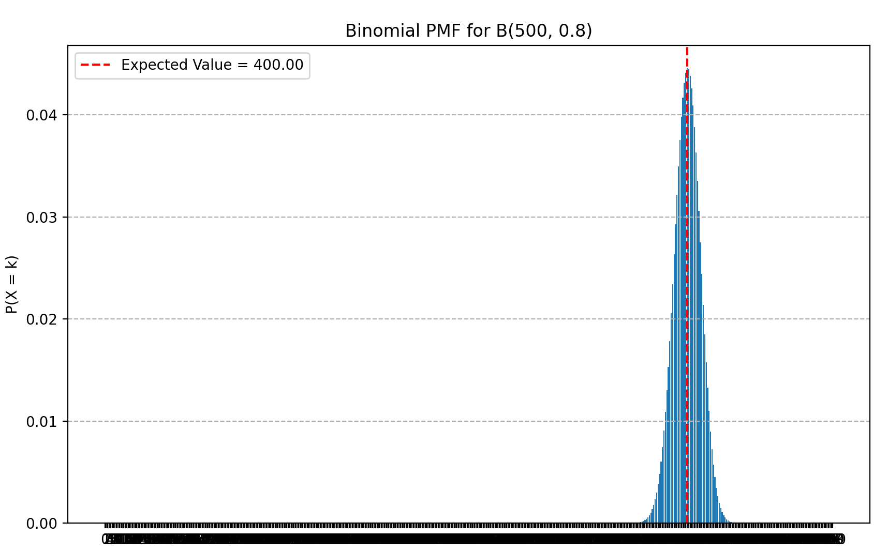
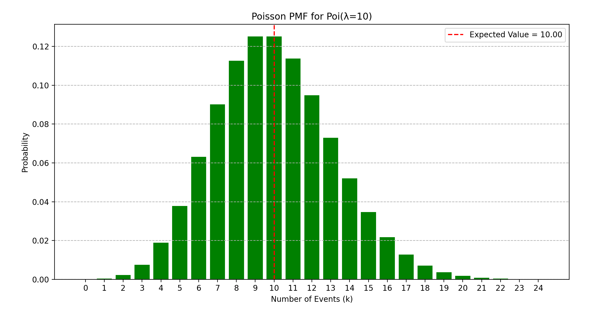
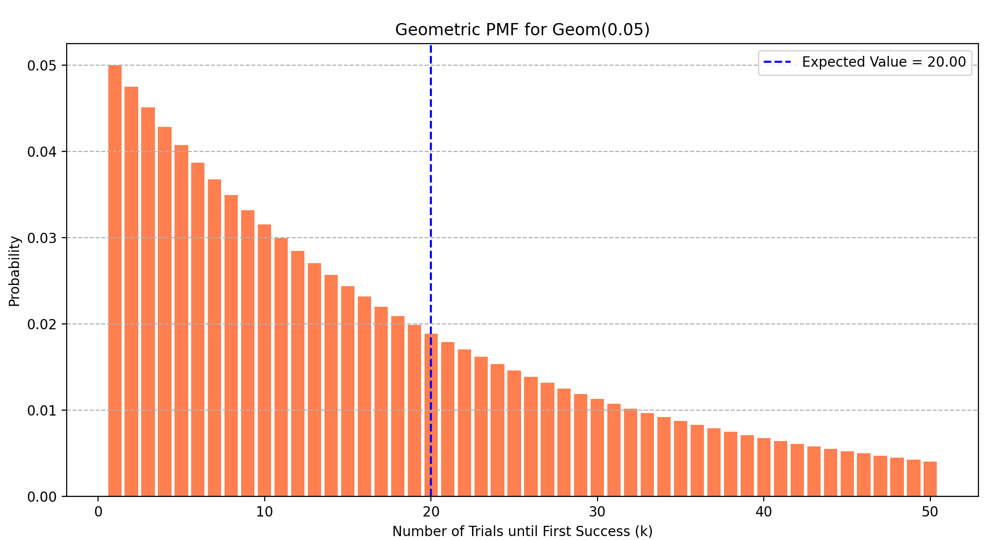
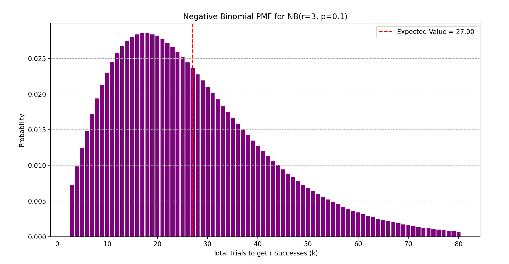
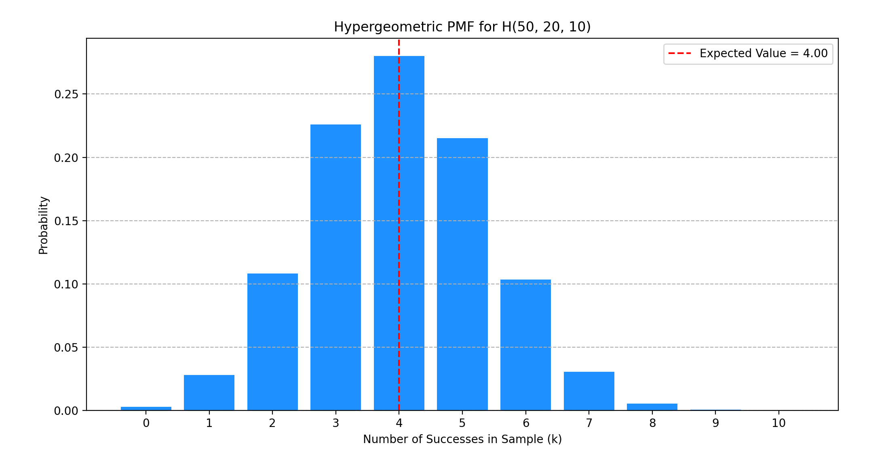

:::note[目录]
1. 方差
2. 伯努利分布
3. 二项分布
4. 泊松分布
5. 几何分布
6. 负二项分布
7. 超几何分布
8. 连续型随机变量
9. 均匀分布
10. 正态分布
11. 联合分布函数
12. 独立随机变量
13. 条件分布
14. Beta分布
:::

## 方差(variance)
用于衡量一组数据与平均值的偏离程度的函数. 

方差大, 说明数据分布的比较分散, 反之则数据分布比较集中.

$$
Var(X) = E[(X - \mu)^2] = E[X^2] - E[X]^2
$$

:::tip[方差的性质]
1. 非负: 当且仅当所有数据点相等, 方差为0
2. $Var(X + c) = Var(X)$
3. $Var(aX) = a^2Var(X)$
4. 若$X, Y$独立, 则$Var(X + Y) = Var(X)+Var(Y)$
:::

### 标准差
方差的量纲与原数据的量纲不同, 因此常用方差的算术平方根来衡量数据的分散程度, 称为标准差(standard deviation).

$$
SD(X) = \sqrt{Var(X)}
$$

## 伯努利分布(bernoulli distribution)
最简单的分布, 但非常重要.

伯努利分布解决的是"Yes"或"No"的问题. 这在逻辑学上比较深刻. 一枚硬币"是正面"与"不是正面", 骰子的点数"大于3"与"不大于3"......所有试验都可以被简单分成两种状态, 即事件$H$与事件$\lnot H$. 可以对应二进制中的1和0.

伯努利分布是对单次随机试验的建模, 该试验只有两个互斥的结果.

某个随机变量$X$的取值只有1和0, 取1的概率为p 称$X$为伯努利随机变量. $X$**服从伯努利分布**, 记作: 

$$
X\sim Ber(p)
$$

注意到一个指示器随机变量$I$是一个伯努利随机变量.

|$X$|$0$|$1$|
|-|-|-|
|$P(X)$|$1-p$|$p$|

其期望为
$$
E[X] = p
$$

其方差为
$$
Var(X) = E[X^2] - E[X]^2 = p - p^2 = p(1-p)
$$

python中的scipy库能够处理伯努利分布.
```python
import matplotlib.pyplot as plt
from scipy.stats import bernoulli

p = 0.3
X = bernoulli(p)    # X \sim Ber(p)

# 伯努利分布
P = X.pmf
print(f"P(X = 1) = {P(1)}, P(X = 0) = {P(0)}")

# 伯努利随机变量的均值和方差
E_X = X.mean()
Var_X = X.var()
print(f"E[X] = {E_X}, Var(X) = {Var_X}")

# 进行n次随机试验
n = 10000
outcomes = X.rvs(size=n)
print(f"20 outcomes = {outcomes[:20]}")

# 可视化
ks = [0, 1]
probs = [X.pmf(k) for k in ks]
plt.bar(ks, probs, tick_label=["Failure (0)", "Success (1)"])
plt.title(f"Bernoulli PMF (p={p})")
plt.ylabel("Probability")
plt.show()
```

## 二项分布(binomial distribution)
二项分布描述了在 n 次独立的伯努利试验中，成功发生 k 次的概率, 可以看作n个独立伯努利分布的和.

伯努利分布可以看作二项分布在n为1时的特殊情况.

:::note[二项分布的前提条件]
1. 总试验次数固定, 为n.
2. n次试验间相互独立
3. 成功概率恒定, 为p.
:::

若某个随机变量$X$表示在$n$次独立的伯努利试验中成功的次数, 每次试验成功的概率均为$p$, 则称X服从二项分布, 记作
$$
X\sim B(n, p)
$$

其PMF为
$$
P(X=k) = C(n, k) \cdot p^k \cdot (1-p)^{n-k}
$$

其期望为
$$
E[X] = np
$$
此处利用结论$E[A+B] = E[A] + E[B]$.

其方差为
$$
Var(X) = np(1-p)
$$
(此处利用方差这一节中提到的结论: 若$A, B$独立, 则$Var(A+B) = Var(A) + Var(B)$)

可以使用scipy库来模拟二项分布.

```python
import numpy as np
from scipy.stats import binom
import matplotlib.pyplot as plt

n, p = 10, 0.8
X = binom(n, p)

# PMF
P = X.pmf
for i in range(n + 1):
    print(f"probability in {n} shots, for hitting {i}: {P(i):.4f}")

# CDF
F = X.cdf
for i in range(n + 1):
    print(f"probability in {n} shots, for hitting not greater than {i}: {F(i):.4f}")

# 期望和方差
E_X = X.mean()
Var_X = X.var()
print(f"\nE[X]: {E_X:.2f}") # 应该等于 n*p = 10*0.8 = 8
print(f"Var(X): {Var_X:.2f}")   # 应该等于 n*p*(1-p) = 10*0.8*0.2 = 1.6

# 可视化
ks = np.arange(0, n + 1)
pmf_values = X.pmf(ks)
plt.figure(figsize=(10, 6))
plt.bar(ks, pmf_values)
plt.title(f'Binomial PMF for B({n}, {p})')
plt.xlabel('k')
plt.ylabel('P(X = k)')
plt.xticks(ks)
plt.grid(axis='y', linestyle='--')
# 标记期望值
plt.axvline(E_X, color='red', linestyle='--', label=f'Expected Value = {E_X:.2f}')
plt.legend()
plt.show()
```
$$n = 10:$$


---

$$n = 50:$$


---

$$n = 100:$$


---

$$n = 500:$$


## 泊松分布(poisson distribution)
强大的数学武器, 用于应对罕见事件.

某事件$F$在极小的范围内的发生率非常非常低(趋近于0), 但在庞大的范围中有可观的平均发生率$\lambda$. 令$X$表示某个固定区间内事件发生的次数, 则称$X$服从泊松分布. 记作$$X\sim Poi(\lambda)$$.

:::tip[条件]
泊松分布需要以下几个条件.
1. 事件独立
2. 事件的平均发生率$\lambda$稳定.
3. 事件不能同时发生.
:::

其PMF为:

$$
P(X=k) = \frac{\lambda^k e^{-\lambda}}{k!}
$$

其期望为
$$
E[X] = \lambda
$$
(一小时事件平均发生5次, 一小时内事件发生的期望次数即为5次)

其方差为
$$Var(X) = \lambda$$
期望与方差相等是泊松分布的重要特征. 这表明一个泊松过程的不确定性和平均发生率成正比. 
:::tip[例]
一个网站的访问量可以看作是一个泊松过程. 在某一具体时刻(比如说某一微秒内), 正好有人访问网站的概率是非常低的. 但在一个区间内(比如每日)的访问量却比较稳定.

泊松过程的期望与方差相等, 这说明其不确定性和平均发生率成正比.
- 一个低流量的网站, 其日均访问量会很稳定的维持在低位.
- 一个高流量的网站, 其日均访问量的波动也很大.
:::

泊松分布可以看作是二项分布在n过大, p过小时(此时期望np适中)的一种近似. 

其与指数分布是描述泊松过程的两个角度. 泊松分布研究某区间内发生事件的次数, 而指数分布则研究事件发生的间隔时间. (间隔时间越久, 在固定时间内发生的次数就越少).

scipy中有poisson库.
```python
import numpy as np
from scipy.stats import poisson
import matplotlib.pyplot as plt

lambda_ = 10
X = poisson(lambda_)

# PMF
P = X.pmf
for i in range(50):
    print(f"P(X = {i}) = {P(i):.4f}")

# CDF
F = X.cdf
for i in range(50):
    print(f"F({i}) = {F(i):.4f}")

# 期望与方差
E_X = X.mean()
Var_X = X.var()
print(f"E[X] = {E_X}") # 应该等于 lambda_ = 10
print(f"Var(X) = {Var_X}")   # 应该也等于 lambda_ = 10

# 可视化
ks = np.arange(0, 25)
pmf_values = X.pmf(ks)
plt.figure(figsize=(12, 6))
plt.bar(ks, pmf_values, color='green')
plt.title(f'Poisson PMF for Poi(λ={lambda_})')
plt.xlabel('Number of Events (k)')
plt.ylabel('Probability')
plt.xticks(ks)
plt.grid(axis='y', linestyle='--')
plt.axvline(E_X, color='red', linestyle='--', label=f'Expected Value = {E_X:.2f}')
plt.legend()
plt.show()
```



## 几何分布(geometric distribution)
等待成功的漫长过程.

若随机变量$X$表示在成功概率为$p$的无穷伯努利试验序列中第一次成功出现时的试验次数, 称随机变量 $X$ 服从几何分布, 记作$$X\sim Geom(p)$$

:::note[注意]
不同的教材和软件库可能会使用不同的定义，注意区分：
1.  **定义一(试验次数)**: $X$ 是第一次成功时**总的试验次数**. $X$ 的可能取值为 $\set{1, 2, 3, ...}$. 例如，第一次就成功，$X=1$.
2.  **定义二(失败次数)**: $Y$ 是第一次成功**之前失败的次数**. $Y$ 的可能取值为 $\set{0, 1, 2, ...}$. 例如，第一次就成功，说明失败了0次，$Y=0$.

大多数情况下使用的都是第一种定义, 我们也采用第一种定义.
:::

几何分布的PMF为
$$
P(X=k) = (1-p)^{k-1} p, \quad k \in \{1, 2, 3, \dots\}
$$

其期望为
$$
E[X] = \frac{1}{p}
$$

其方差为
$$
Var(X) = \frac{1-p}{p^2}
$$

:::note[无记忆性]
几何分布最重要的特性, 也是几何分布的核心所在.
$$
P(X > n+k \mid X > n) = P(X > k)
$$

无记忆性告诉我们, 抛一枚硬币连续十次都是正面, 下一次抛出反面的概率并不会增大. 事实上, 第十一次抛硬币与第一次抛硬币是完全一样的.
:::

```python
import numpy as np
from scipy.stats import geom
import matplotlib.pyplot as plt

p = 0.05

X = geom(p)

# PMF
P = X.pmf
for i in range(30):
    print(f"P(X = {i}): {P(i):.4f}")

# CDF
F = X.cdf
for i in range(30):
    print(f"F({i}): {F(i):.4f}")

# 期望, 方差
E_X = X.mean()
Var_X = X.var()
print(f"E[X] = {E_X}, Var(X) = {Var_X}")

# 可视化
ks = np.arange(1, 51)
pmf_values = X.pmf(ks)
plt.figure(figsize=(12, 6))
plt.bar(ks, pmf_values, color='coral')
plt.title(f'Geometric PMF for Geom({p})')
plt.xlabel('Number of Trials until First Success (k)')
plt.ylabel('Probability')
plt.grid(axis='y', linestyle='--')
plt.axvline(E_X, color='blue', linestyle='--', label=f'Expected Value = {E_X:.2f}')
plt.legend()
plt.show()
```



## 负二项分布(negative binomial distribution)
负二项分布是几何分布的加强版.

负二项分布和二项分布具有某种相反关系, 可以由PMF和期望中看到.

我们知道, 几何随机变量表示到达第一次成功所需要的次数. 负二项随机变量即是几何随机变量的加强版, 到达第r次成功所需要的次数. 记作$$X \sim NB(r, p)$$

与几何分布一样, 这里也取负二项随机变量的定义为"获得第r次成功时总的试验次数".

负二项分布可以看作r个独立几何分布的和. 原因在于几何分布的无记忆性. 我们可以把获得r次成功的目标进行分解, 变成:
`失败, 失败, 获得第一次成功, 失败, ..., 获得第二次成功, ..., ..., 获得第n次成功`

而我们知道, 由于几何分布的无记忆性, 获得第一次成功后的试验与从第一次开始试验是等价的, 所以从第一次成功后到第二次成功相当于一个全新的几何分布, 并且与前面的几何分布独立. 所以, 负二项分布相当于r个独立的几何分布.

:::tip[PMF推导过程]
$P(X = k)$表示, 随机变量$X$在第$k$次试验时, 正好取得$r$次成功. 故:
1. 第$k$次时试验成功.
2. 前$k - 1$次试验中, 恰好有$r - 1$次试验成功. 这与二项分布的要求相同.

即: 

$$
P(X=k) = \underbrace{\left( C(k-1, r-1) p^{r-1} (1-p)^{k-r} \right)}_{\text{前 k-1 次试验中有 r-1 次成功}} \times \underbrace{p}_{\text{第 k 次试验成功}}
$$

故

$$
P(X = k) = \binom{k - 1}{r - 1}p^r(1 - p)^{k - r}
$$
:::

由于负二项分布相当于r个独立的几何分布之和, 负二项分布的期望为: 
$$
E[X] = \frac{r}{p}
$$

其方差为
$$
Var(X) = \frac{r(1-p)}{p^2}
$$

scipy中的nbinom可以实现二项式分布.

```python
import numpy as np
from scipy.stats import nbinom
import matplotlib.pyplot as plt

r = 3
p = 0.1

X = nbinom(r, p)

# PMF
P = X.pmf
for i in range(30):
    print(f"P(X = {i}) = {P(i):.4f}")

# CDF
F = X.cdf
for i in range(30):
    print(f"P(X <= {i}) = {F(i):.4f}")

# 期望和方差
E_X = X.mean()
Var_X = X.var()
print(f"E[X] = {E_X:.2f}")
print(f"Var(X) = {Var_X:.2f}")

# 可视化
ks = np.arange(r, 81)
pmf_values = X.pmf(ks)
plt.figure(figsize=(12, 6))
plt.bar(ks, pmf_values, color='purple')
plt.title(f'Negative Binomial PMF for NB(r={r}, p={p})')
plt.xlabel('Total Trials to get r Successes (k)')
plt.ylabel('Probability')
plt.grid(axis='y', linestyle='--')
plt.axvline(E_X, color='red', linestyle='--', label=f'Expected Value = {E_X:.2f}')
plt.legend()
plt.show()
```


## 超几何分布(Hypergeometric Distribution)
大家高中应该都学过, 就不多讲了. 超几何分布可以看作是二项分布的一个改进, 从有放回变为了无放回.

n个样品, m个残次品, 抓k个, 随机变量X表示抓到的残次品个数. 称为超几何随机变量. 记作
$$
X\sim H(n,m,k)
$$

$\frac{m}{n}$可以对应二项分布中的$p$

其PMF为
$$
P(X=i) = \frac{C(m, i) \cdot C(n - m, k - i)}{C(n, k)}
$$
, 这里$i$的取值要求所有满足组合数有意义, 即$0\le i \le m, 0\le k - i\le n-m$

其期望为
$$
E[X] = k \cdot \frac{m}{n}
$$

其方差为
$$
Var(X) = k \cdot \frac{m}{n} \cdot \left(1 - \frac{m}{n}\right) \cdot \frac{n-k}{n-1}
$$

如何理解? 如果把$\frac{m}{n}$当做二项分布中的$p$, 则前面的$$k \cdot \frac{m}{n} \cdot \left(1 - \frac{m}{n}\right)$$
部分与二项分布的方差一样.

而$$\frac{n-k}{n-1}$$这一项称为**有限总体修正系数 (Finite Population Correction, FPC)**. 这个系数永远小于1, 这说明**无放回抽样的方差要小于有放回抽样**, 因为每次抽样都减少了总体的不确定性. 

当总体$n$远大于样本$k$时, $\frac{n-k}{n-1}$会趋近1, 此时超几何分布会趋近于二项分布.

scipy中的hypergeom提供了超几何分布的实现.
```python
import numpy as np
from scipy.stats import hypergeom
import matplotlib.pyplot as plt


n, m, k = 50, 20, 10

X = hypergeom(n, m, k)

# PMF
P = X.pmf
for i in range(10):
    print(f"P(X = {i}) = {P(i):.4f}")

# CDF
F = X.cdf
for i in range(10):
    print(f"F({i}) = {F(i):.4f}")

# 期望和方差
E_X = X.mean()
Var_X = X.var()
print(f"\nE[X] = {E_X:.2f}") # 应该等于 n*(K/N) = 20*(10/50) = 4
print(f"Var(X) = {Var_X:.2f}")

# 可视化
ks = np.arange(0, k + 1)
pmf_values = X.pmf(ks)

plt.figure(figsize=(12, 6))
plt.bar(ks, pmf_values, color='dodgerblue')
plt.title(f'Hypergeometric PMF for H({n}, {m}, {k})')
plt.xlabel('Number of Successes in Sample (k)')
plt.ylabel('Probability')
plt.xticks(ks)
plt.grid(axis='y', linestyle='--')
plt.axvline(E_X, color='red', linestyle='--', label=f'Expected Value = {E_X:.2f}')
plt.legend()
plt.show()
```



