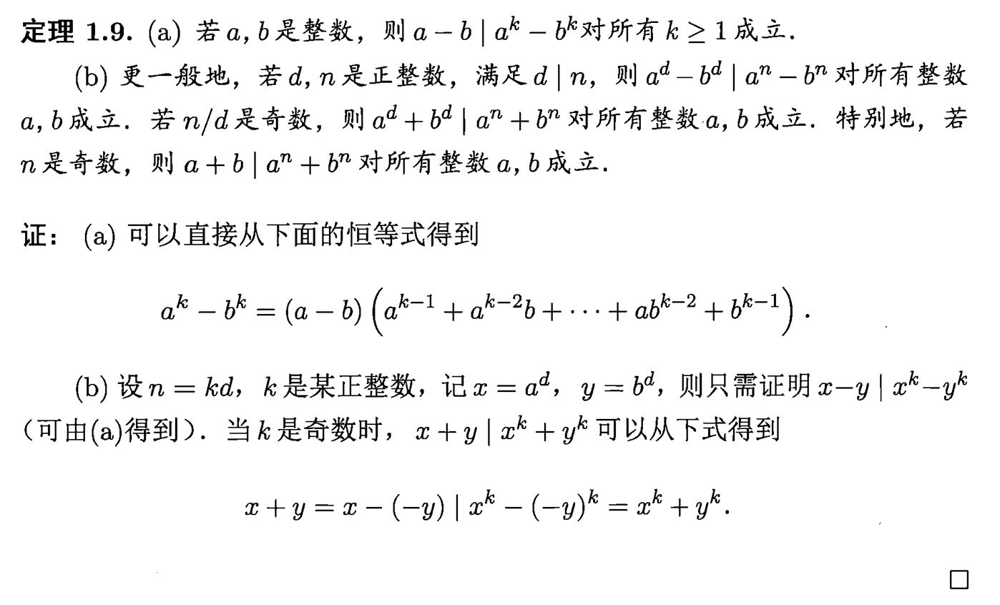
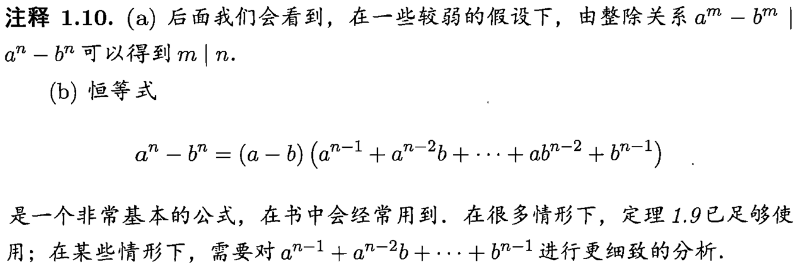
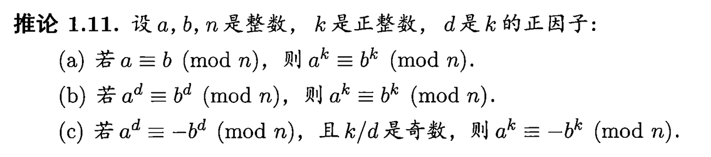

## 整除和同余的性质
整除是一种关系. 若$\exist c, \text{使得}\space b = ac$, 则称$a|b$, 或a整除b.

若n是偶数, 则可以写作$2k$的形式, 则$n^2 = 4k^2$, 是4的倍数

若n是奇数, 则可以写作$2k+1$的形式, 则$n^2 = 4k^2 + 4^k + 1 = 4k(k + 1) + 1$
这里知道$k$和$k+1$其中必有且仅有一个偶数, 则$n^2 = 8q + 1$.

:::tip[整除关系性质]
1. 自反性: $a|a$
2. 传递性: 若$a|b$, $b|c$, 则$a|c$
3. 若$a|b_1, a|b_2, ..., a|b_n$, 则$a|c_1b_1 + c_2b_2 + ... + c_nb_n$对于任意$c_1, c_2, ... , c_n$成立
4. 若$n|a - b$, $n|a'-b'$则$n|aa'-bb'$
:::

模n同余是一种关系, 称$a\equiv b\space (mod\space n)$当且仅当$n|(b-a)$.

:::tip[同余的性质]
1. 自反性: $a\equiv a\space (mod\space n)$
2. 对称性: $a\equiv b\space (mod\space n)$则$b\equiv a\space (mod\space n)$
3. 传递性: $a\equiv b\space (mod\space n)$, $b\equiv c\space (mod\space n)$, 则$a\equiv c\space (mod\space n)$
4. 若$a\equiv b\space (mod\space n)$, $c\equiv d\space (mod\space n)$, 则$(a + b)\equiv (c + d)\space (mod\space n)$, 且$ab\equiv cd\space (mod\space n)$
5. 若$a\equiv b\space (mod\space n)$, 则$ac\equiv bc\space (mod\space nc)$, 在$c\ne0$时反过来也成立.
:::

