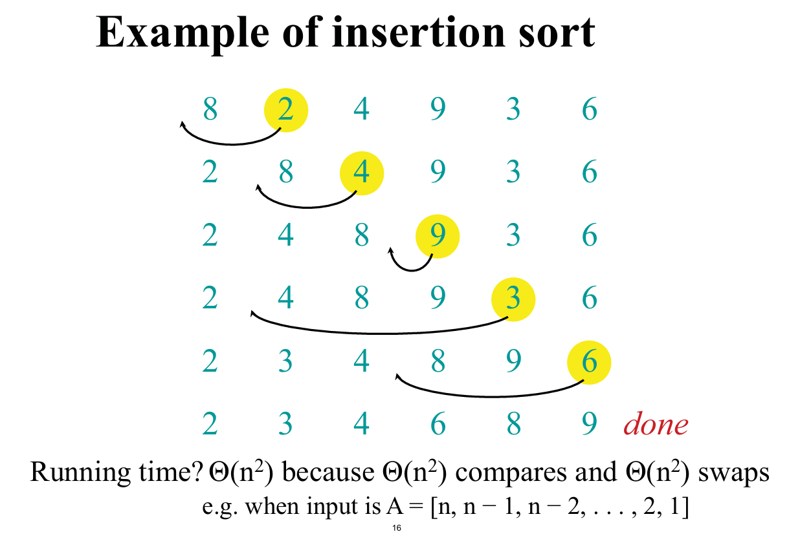
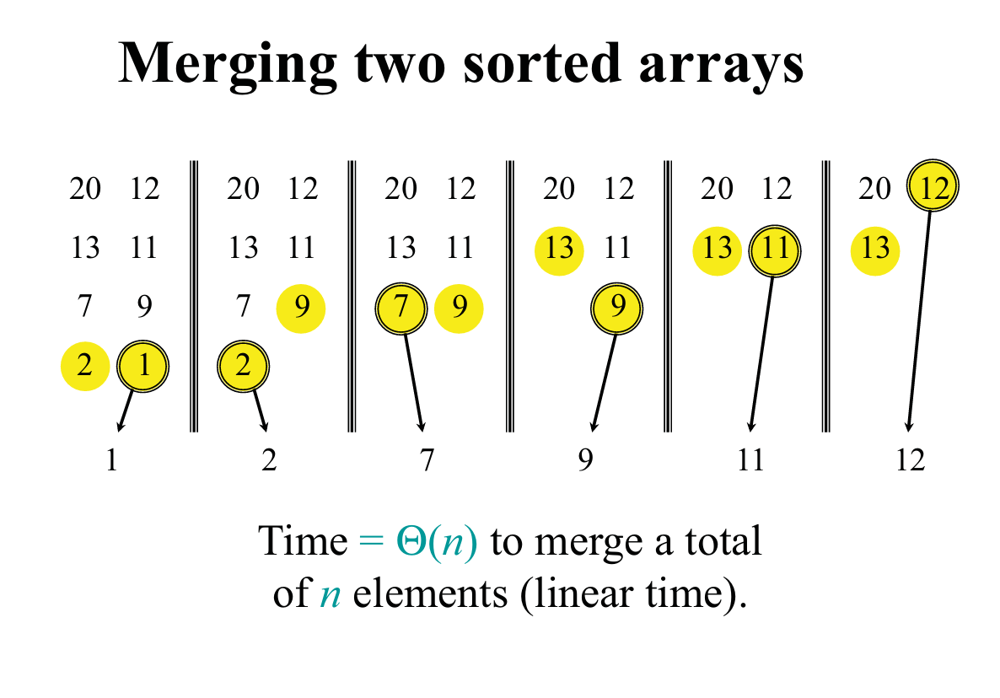
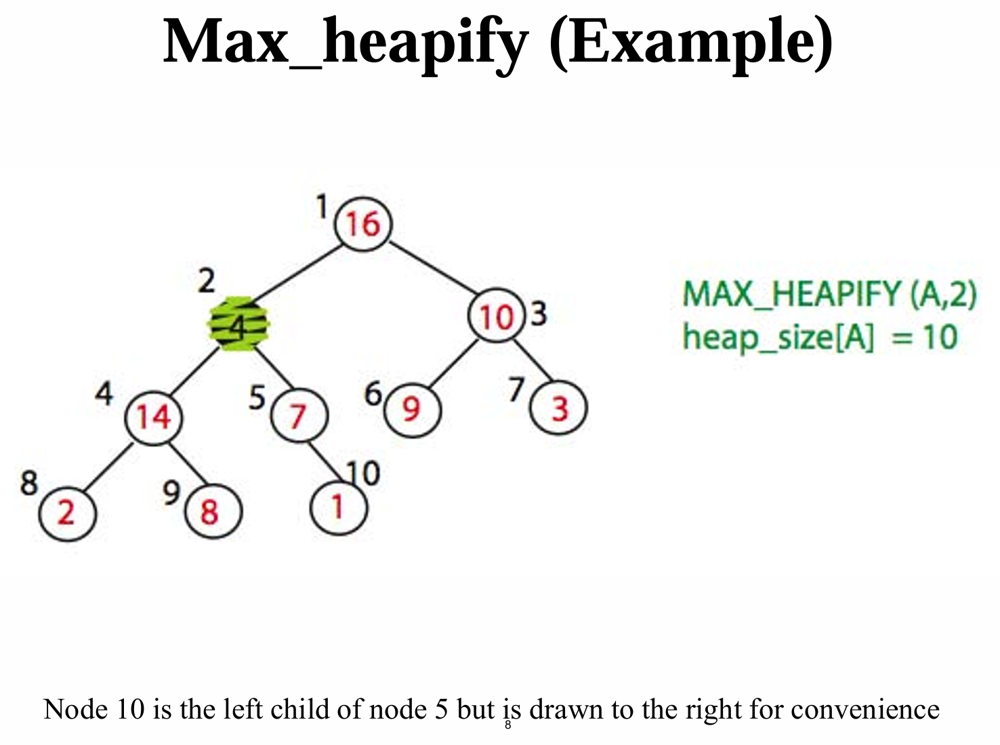
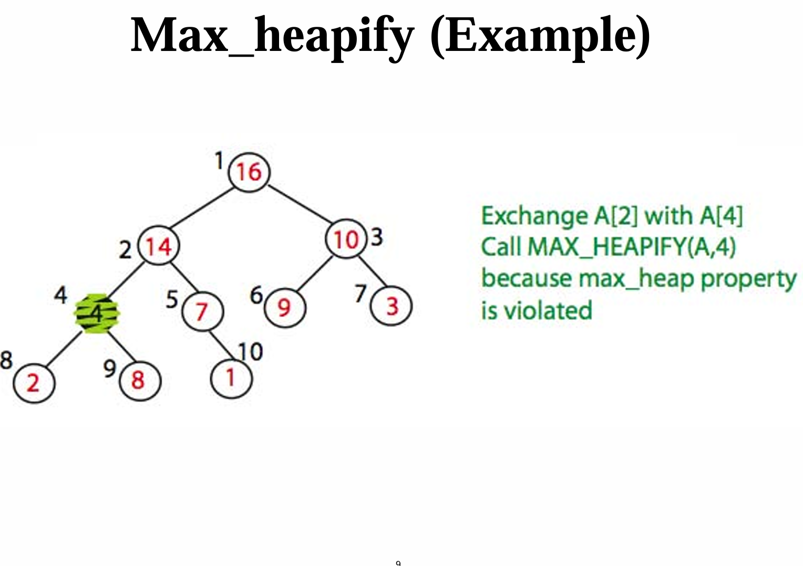
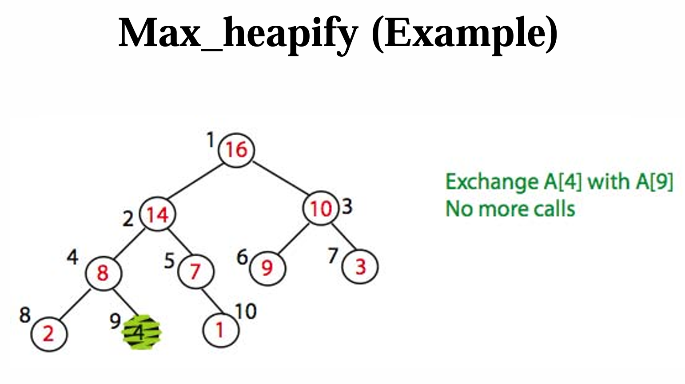
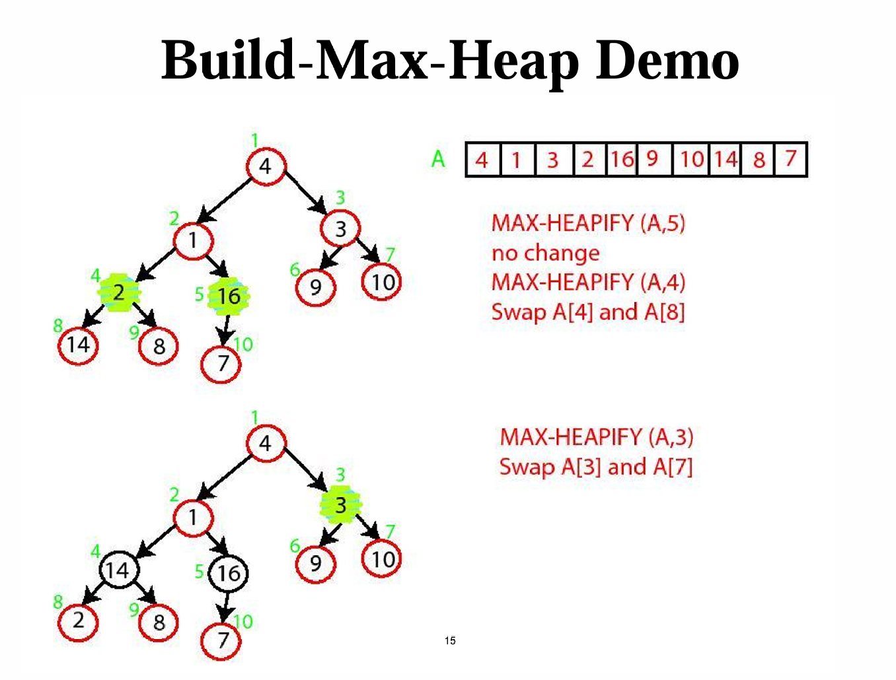
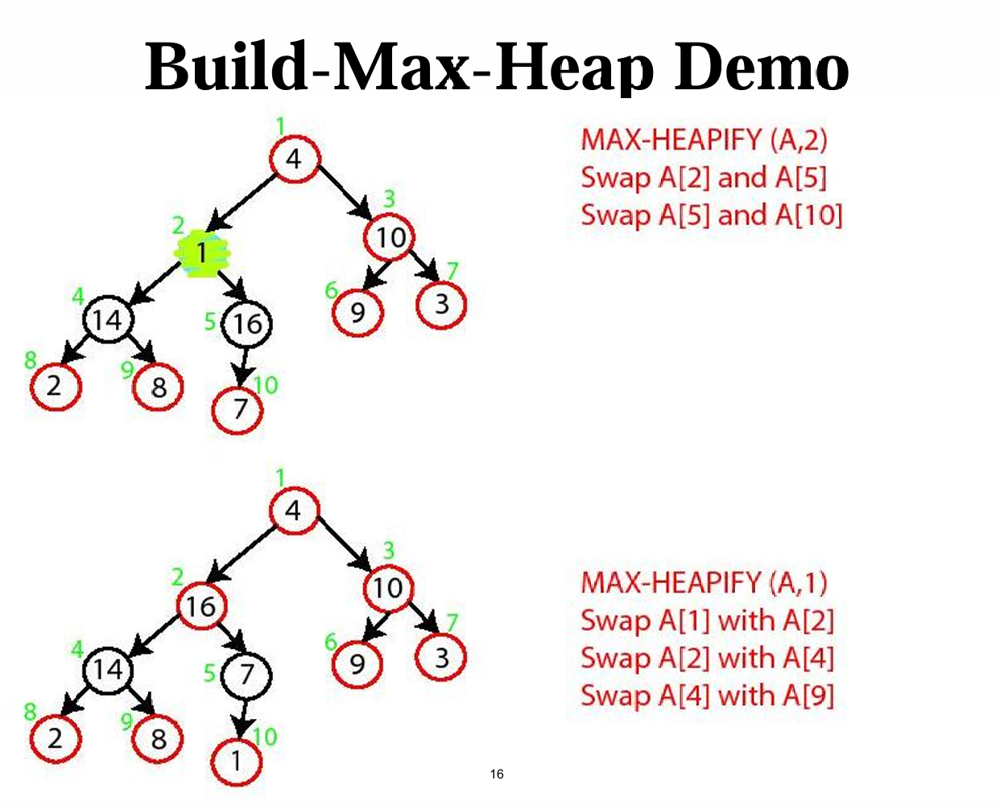
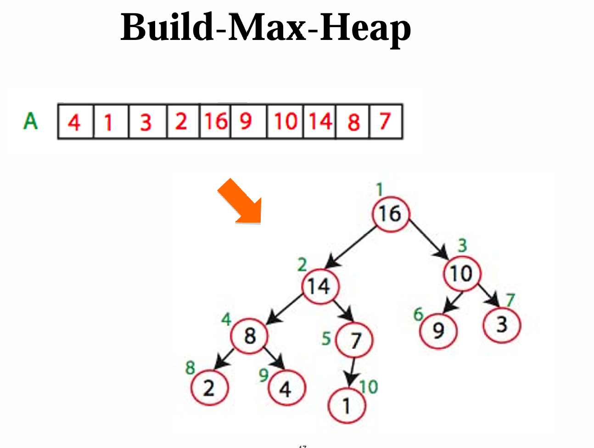

:::note[目录]
1. [插入排序](./#插入排序insertion-sort)
2. [归并排序](./#归并排序merge-sort)
3. [优先级队列](./#优先级队列priority-queue)
4. [堆](./#堆heap)
5. 二叉搜索树
:::

## 插入排序(insertion sort)

对于一个数组A, 指针key用来遍历数组A.
指针key每次移动后都要保证A[0:key + 1]已排序.
通过将key处的数字前移到正确位置来实现.
当key到达数组末尾时, A[0:n]排序完毕, 即整个数组排序完毕.

### 插入操作


:::tip[时间复杂度]
移动需要O(n^2)
比较操作的时间复杂度取决于key处的数字前移的实现方式:
1. 如果使用比较并交换相邻数字来实现, 那么比较操作的时间复杂度为$O(n^2)$.
2. 如果使用二分查找来实现, 那么比较的时间复杂度为$O(n\log n)$

如果比较操作的开销远大于移动的开销, 那么使用二分查找的时间复杂度将会更优. 如果比较操作开销与移动操作开销相等, 那么时间复杂度均为O(n^2).
:::

### 代码实现
```python
def insertion_sort_swap(A):
    """
    对数组A进行插入排序, 使用交换实现.
    一种O(n^2)的原地稳定排序.
    """
    for key in range(len(A)):
        val = A[key]
        # 将A[key]处的数插入至A[0:key - 1]中正确的位置
        i = key - 1
        while i > -1 and A[i] > val:
            A[i + 1] = A[i]
            i = i - 1
        A[i + 1] = val
    return A
```

```python
def insertion_sort_binary(A):
    """
    对数组A进行插入排序, 使用二分实现.
    一种O(n^2)的原地稳定排序.
    在比较开销显著大于移动开销时, 具有更好的时间复杂度.
    """
    # 共n次
    for key in range(len(A)):
        val = A[key]
        del A[key]
        # 将A[key]处的数插入至A[0:key - 1]中正确的位置
        l, r = -1, key
        mid = (l + r) // 2
        # 二分查找, 单次O(log n)
        while not r == l + 1:
            if A[mid] <= val:
                l = mid
            else:
                r = mid
            mid = (l + r) // 2
        # 插入, 单次O(n)
        A.insert(mid + 1, val)
    return A
```


## 归并排序(merge sort)
分治思想.

### 基础情况:
若数组只有1个元素, 返回原数组.

### 递归情况:
1. 将数组划分成左数组L与右数组R
2. 对左数组L和右数组R分别排序
3. 合并排序后的L和R.

### 合并操作:


### 复杂度分析:
1. 划分需要$O(\log n)$
2. 递归需要$O(n)$
3. 合并需要:
   1. 第一层需要$O(n)$
   2. 第二层需要$2O(n/2)$, 即$O(n)$
   3. 第三层需要$4O(n/2)$, 即$O(n)$
   4. ...
故合并需要的时间复杂度为n*层数, 即$O(n\log n)$

### 代码实现
```python
def merge(A, B):
    """
    归并排序对应的合并操作.
    开销O(n).
    """
    L = []
    key_a = key_b = 0
    while True:
        # 空列表判定
        if key_a >= len(A):
            L.extend(B[key_b:])
            return L
        elif key_b >= len(B):
            L.extend(A[key_a:])
            return L

        # 合并
        if A[key_a] > B[key_b]:
            L.append(B[key_b])
            key_b += 1
        else:                   # 保证排序稳定性
            L.append(A[key_a])
            key_a += 1

def merge_sort(A):
    """
    对数组A进行归并排序.
    一个时间复杂度O(nlog n)的稳定非原地排序.
    空间开销为O(n)
    """
    # base case
    if len(A) <= 1:
        return A

    # recursion
    mid = len(A) // 2
    L = A[0:mid]
    R = A[mid:len(A)]
    L = merge_sort(L)
    R = merge_sort(R)
    return merge(L, R)
```

:::note[树形递归的时间复杂度]
1. 每次递归需要$O(n)$:
$$
T(n) = 2T(n/2) + cn
$$
解得
$$
T(n) = O(n\log n)
$$
(归并排序的时间复杂度)

2. 每次递归需要$O(1)$:
$$
T(n) = 2T(n/2) + c
$$
解得
$$
T(n) = O(n)
$$
3. 每次递归需要$O(n^2)$:
$$
T(n) = 2T(n/2) + cn^2
$$
解得
$$
T(n) = O(n^2)
$$
:::


## 优先级队列(priority queue)
实现某个集合$S$, $S$中的每个元素都有对应的优先级(不同元素的优先级可能相同).
$S$应当支持如下操作:
1. 插入新元素
2. (移除并)获取最大值.
3. 改变某元素的优先级

**堆**是优先级队列的一种实现
## 堆(Heap)
是一个数组, 也可以看作一个完全二叉树, 堆h的根节点为h[1].
对于节点x来说:
1. 其父节点: x = 1时无父节点, x > 1时父节点为x // 2, 或x >> 1.
2. 左子节点: 2 * x, 或x << 1.
3. 右子节点: 2 * x + 1, 或x << 1 + 1.
**大根堆**: 每个节点都大于它的子节点(如果存在). 小根堆类似.

:::tip[二叉堆的性质]
1. 叶子节点永远占一半(ceil(n/2)), 非叶子结点占(floor(n/2)). 这同时也说明最后一个叶子节点的编号除以2即是最后一个非叶子结点.
:::

### 堆的操作
1. 建大根堆: 从无序数组中建立一个大根堆.
2. 大根堆化(max_heapify)
3. 插入
4. (移除并)获取最大值
5. 堆排序.

### 大根堆化(max_heapify)
对于单个违反堆序的节点, 将其移动至正确的位置, 设以其为根节点的子堆高度为n, 则大根堆化所需时间复杂度为$O(log n)$.

概括地说, 对于某个需要大根堆化的节点x, 持续将x与左右子节点比较, 交换, 直到:
1. x大于左节点, 且x大于右节点
2. x已无左右子节点





### 建大根堆
从n/2位置开始逆序遍历到1, 每个节点都进行大根堆化.
(从n/2位置开始是因为大于n/2的节点均是叶子节点, 无需大根堆化, 逆序是为了保证建堆过程的无后效性)

时间复杂度: $T =  c(\frac{n}{4} + \frac{2n}{8} + \frac{3n}{16} + \frac{4n}{32} + ... + \log n)$
求和后可以知道时间复杂度为$O(n)$.






### 堆排序(heap sort)
1. 建大根堆A
2. 弹出A[1]
3. 交换A[n]与A[1], A的size减少1.
4. 对A[1]大根堆化.
5. 重复步骤2到5, 直到A的size为0.

时间复杂度: $O(nlog n)$

### 代码实现
```python
def max_heapify(A, x):
    """
    将堆A (A[0]储存堆元素个数n, 实际索引从1开始) 的某个违反堆序的节点x大根堆化.
    """
    lt = 2 * x
    rt = 2 * x + 1
    # 确定x, lt, rt中最大的, 并与x交换
    if lt <= A[0] and A[x] < A[lt]:
        largest = lt
    else:
        largest = x

    if rt <= A[0] and A[rt] > A[largest]:
        largest = rt

    # 如果并未交换, 说明x在正确位置上
    if x == largest:
        return

    # 否则则说明x在largest位置上, 递归
    A[x], A[largest] = A[largest], A[x]
    max_heapify(A, largest)

def build_max_heap(A):
    """
    从数组A建堆(索引从0开始)
    """
    # 保证堆的索引从1开始, A[0]储存堆的元素个数n.
    A.insert(0, len(A))

    # 从n / 2开始倒序遍历.
    i = A[0] // 2
    while i > 0:
        max_heapify(A, i)
        i -= 1

def insert(A, val):
    """
    向堆A(A[0]储存元素个数n, 索引从1开始)中插入值val
    """
    # 若数组大小不足, append, 反之则赋值
    idx = A[0] + 1
    if idx == len(A):
        A.append(val)
    else:
        A[idx] = val
    A[0] += 1

    # 上滤, 每次比较节点与其父节点
    while idx != 1 and A[idx] > A[idx // 2]:
        A[idx], A[idx // 2] = A[idx // 2], A[idx]
        idx = idx // 2

def top(A):
    """
    查询堆顶
    """
    return A[1]

def pop(A):
    """
    移除(塞至堆尾并size-1)并返回堆顶
    """
    last = A[0]
    A[1], A[last] = A[last], A[1]
    A[0] -= 1
    max_heapify(A, 1)
    return A[last]

def heap_sort(A):
    """
    对某数组A进行升序堆排序, 索引从0开始
    一种O(nlog n)的原地非稳定排序.
    """
    build_max_heap(A)
    while A[0] > 0:
        pop(A)      # 每次将最大元素塞至队尾
    del A[0]        # 将A恢复为数组
```

## 


## 二叉搜索树(BST)
数组的二分查找可以做到$O(\log n)$, 但插入操作为$O(n)$.

链表可以做到$O(1)$插入, 但无法二分查找, 查找操作为$O(1)$. 

链式存储并非绝对不适合二分查找. 回顾数组的二分查找过程:
1. 我们找到数组的中点, 并以此为基准将其分成两半
2. 在左半边或右半边的数组进行查找, 数组的元素数量减半.
3. 继续下去, 直至数组的元素个数为1.

我们可以发现, 这个过程中访问的节点可以形成一个有向图. 原数组中点指向左数组中点和右数组中点, 而左数组中点又指向1/4数组中点和2/4数组中点... 每个节点都指向对应的左半边中点和右半边中点, 形成一个二叉树.

这个二叉树就是二叉搜索树(Binary Search Tree, BST), 它是一种能够进行二分查找的链式数据结构. 在理想状态下具有$O(\log n)$的查找效率. 相应地, 插入操作会变慢, 为$O(\log n)$.

二叉搜索树的递归定义如下:
1. 空树是一个二叉搜索树.
2. 二叉搜索树的子树是二叉搜索树.
3. 对于任意节点$x$, $x$大于其左子树的所有节点, 小于其右子树的所有节点.

### BST的操作
1. 插入: insert(val)
2. 求元素排名: find(val)
3. 删除: remove(val)
4. 
