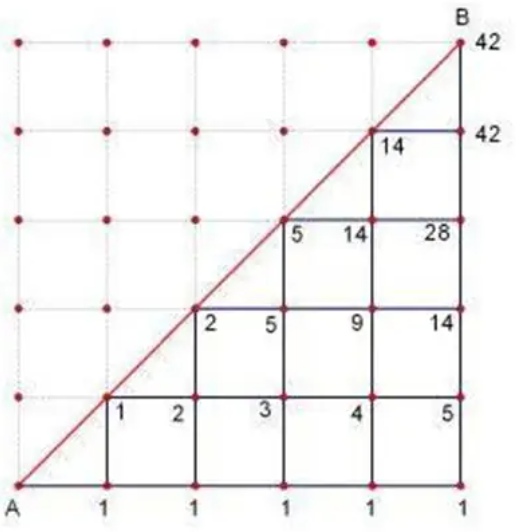

## 数值计算
我们知道, 计算机中的数据是离散的(所有数据本质上都是二进制整数). 对于有理数, 我们可以使用两个整数的比值来精确表示, 但无理数呢? 我们只能进行**近似**, 如何用离散的计算机来处理(精确近似, 高效计算)无理数这样连续的数据, 是数值计算的核心课题.

## 高精度平方根
牛顿切线法(或牛顿法)是用于求方程$f(x) = 0$的数值解的方法, 可以用来做很多事.

比如, 要计算$\sqrt{2}$, 只需求出方程$x^2 - 2 = 0$的根即可.

:::tip[牛顿法的步骤]
1. 猜测一个根$x_0$.
2. 判断这个根是否就是答案(满足精度要求).
3. 若不满足, 在$x_0$处建立$f(x)$的切线. 求出切线与$x$轴的交点$x_{1}$
4. 将$x_{1}$作为新的猜测值, 重复步骤2.
:::

公式为
$$
x_{i+1} = x_i - \frac{f(x_i)}{f'(x_i)}
$$

用牛顿法求b的平方根:
$$
x_{i+1} = x_i - \frac{f(x_i)}{f'(x_i)} = \frac{x_i}{2} + \frac{b}{2x_i}
$$

的收敛速度极快. 每次迭代正确的有效数字位数大约会翻一倍, 这种收敛速度被称为**二次收敛(Quadratic convergence)**, 分析如下:
:::tip[牛顿切线法求平方根的误差收敛速度分析]
1. 我们假设真实值为$x$, 那么$b = x^2$, 第$i$次迭代的猜测$x_i$的相对误差为$\epsilon$. 即$x_i = x(1 + \epsilon)$
2. 第$i + 1$次迭代的相对误差为
$$
\frac{x_{i+1}}{x} - 1 = \frac{x+x\epsilon}{2x} + \frac{b}{2x^2 + 2x^2\epsilon} - 1 = \frac{x^2 + 2\epsilon x^2 + \epsilon^2 x^2 + b - 2x^2 - 2\epsilon x^2}{2x(x+x\epsilon)} = \frac{\epsilon^2}{2(1 + \epsilon)}
$$
这与$\epsilon^2$是同一个量级.
:::

我们发现, 牛顿切线法求高精度的平方根的过程, 涉及高精度乘法运算和高精度除法运算.

## 高精度乘除法
默认读者已经掌握基本的高精度乘法, 比如竖式法.

竖式法的时间复杂度: $O(n^2)$

简单地对高精度乘进行分治并不能改变这个时间复杂度, 依然是$O(n^2)$.

### 高精度乘法: Karatsuba算法

:::tip[分治高精度乘(Karatsuba算法)]
1. 将$r$进制下$n$位(n为偶数)的数$x$分成两个$\frac{n}{2}$位的数, 高位记作$x_1$, 低位记作$x_0$. $x = x_1r^{n/2} + x_0$. 同理$y = y_1r^{n/2} + y_0$
2. 相乘$x$与$y$, 展开, 得到$xy = x_1r^{n/2}y_1r^{n/2} + x_0y_1r^{n/2} + y_0x_1r^{n/2} + x_0y_0 = x_1y_1r^n + (x_0y_1 + y_0x_1)r^{n/2} + x_0y_0$.
3. 常规分治需要做4次乘法$x_1y_1, x_0y_1, y_0x_1, x_0y_0$, 这样做的复杂度是$T(n) = 3T(\frac{n}{2}) + O(n)$, 这导致总的时间复杂度依然是$O(n^2)$.
4. Karatsuba注意到, 我们计算$x_0y_1 + y_0x_1$其实不需要2次乘法!
5. 先计算$x_1y_1, x_0y_0$, 分别记为$z_1$和$z_2$(第一次乘法和第二次乘法), 再计算$z_3 = (x_0 + x_1)(y_0 + y_1)$(第三次乘法)
6. 我们将$z_3$展开, $z_3 = x_0y_0 + x_0y_1 + x_1y_0 + x_1y_1$, 移项后就有$x_0y_1 + x_1y_0 = z_3 - z_1 - z_2$
7. 于是我们只用了3次乘法和一些额外的加减法就得到了原来的结果.
8. 复杂度分析: $T(n) = 3T(\frac{n}{2}) + O(n)$, 最后得到$T(n) = O(n^{\log_2{3}}) \approx O(n^{1.585})$
:::

Karatsuba算法目前被用于python大数乘法的部分实现. 这是一个革命性的突破. 它第一次向世界展示: 我们长期以来认为最优的算法, 可能并非最优. 在Karatsuba算法提出以后, 才出现了更多对高精度乘法时间优化的算法, 包括:
1. Toom-Cook算法, 将复杂度优化到了$O(n^{log_2 5}) \approx O(n^{1.465})$
2. Schönhage–Strassen(SSA)算法: 基于FFT算法. 复杂度为 $(O(n \log n \log \log n))$
3. Fürer 算法, 理论上具有$\Theta (n\log n2^{O(\log *n)})$, 其中$\log *n$表示渐进$\log n$, 但常数因子巨大, 仅有理论意义. 这个复杂度非常接近$O(n\log n)$. 我们可以猜测, 高精度乘法算法应该有一个$O(n\log n)$的理论下界.

### 高精度除法
要计算高精度的$\frac{a}{b}$, 只需先计算高精度的$\frac{1}{b}$, 再将$a$与$\frac{1}{b}$进行高精度相乘即可.

所以问题转化为怎么求出高精度倒数$\frac{1}{b}$. 所谓高精度倒数, 其实就是$\frac{R}{b}$的取整, 其中$R$是一个大数, 并且适合作为除数(通常取10或2的整数次幂), 影响我们的计算精度, $R$越大, 计算精度越高, 比如$R = 10^9$代表b的精度达到了$10^{-8}$.

我们可以使用**牛顿切线法**. 设$x = \frac{R}{b}$, 则有$f(x) = \frac{1}{x} - \frac{b}{R} = 0$(为什么不用$bx - R = 0$呢, 因为这样不方便计算). $f'(x) = -\frac{1}{x^2}$.

所以每次迭代为$x_{i+1} = x_i - \frac{f(x_i)}{f'(x_i)} = 2x_i- \frac{bx_i^2}{R}$. 这里只涉及高精度乘法, 不涉及高精度除法. 于是我们就求出了高精度的$\frac{1}{b}$

:::tip[高精度除法的误差收敛分析]
1. $x_{i + 1} = 2x_i - \frac{bx_i ^2}{R}$, 假设$x_i = \frac{R}{b}(1+\epsilon)$
2. 迭代后误差为$\frac{x_{i + 1}}{x_i} - 1 = -\epsilon ^ 2$
:::

故使用牛顿切线法迭代高精度除法也是二次收敛的.

:::tip[高精度除法的时间复杂度分析]
1. 假设单次$d$位的高精度乘法复杂度为$O(M(d))$.
2. 我们知道牛顿切线法需要$O(\log d)$才能达到$d$位的精度, 所以高精度除法需要迭代$d$次, 每次迭代需要一次高精度乘法, 所以最初我们认为高精度除法达到d位的时间复杂度为$O(M(d)\log d)$
3. 然而, 并不是每一次迭代都需要全精度的高精度乘法. 假如第一次迭代我们需要2位精度, 我们只需要进行2位精度的高精度乘法. 第二次迭代只需要4位精度的高精度乘法...
4. 通过等比数列求和, 我们知道高精度除法所需要的时间复杂度为$O(D(d)) = O(M(d))$, 即高精度除法所需的时间复杂度与高精度乘法同阶.
:::

最后, 我们来分析高精度平方根的时间复杂度.

:::tip[高精度平方根的时间复杂度分析]
1. 假设单次$d$位的高精度乘除法复杂度为$O(D(d)) = O(M(d))$. 所以单次迭代的乘除法开销为O(M(d)).
2. 假如第一次迭代我们需要2位精度, 我们只需要进行2位精度的高精度乘除法. 第二次迭代只需要4位精度的高精度乘除法...
3. 通过等比数列求和, 我们知道高精度平方根所需要的时间复杂度为$O(S(d)) = O(D(d)) = O(M(d))$, 即高精度平方根所需的时间复杂度与高精度乘除法同阶.
:::

所以说高精度乘法, 高精度除法, 高精度平方根的时间复杂度同阶. 高精度乘法越快, 高精度除法和平方根的速度也就越快, 这也就是为什么我们需要不断优化高精度乘法的复杂度. 

## PS: 卡特兰数
讲义中出现的一种数列, 与本章主要内容无关.
会出现在各种奇怪的问题里: 
1. 给定$n$对括号, 问有多少种合法的(正确匹配的)括号序列组合? 
   1. n = 1, ans = 1,
   2. n = 2, ans = 2,
   3. n = 3, ans = 5,
   4. n = 4, ans = 14
   5. ...
2. 在一个$n \times n$并且只有一半的三角形方格网(包括对角线)上, 每次只能向上或向右走一步, 从左下角 $(0,0)$ 走到右上角 $(n,n)$的方案数.
   1. n = 1, ans = 1,
   2. n = 2, ans = 2,
   3. n = 3, ans = 5,
   4. n = 4, ans = 14
   5. ...
3. n个节点的二叉树形态数
4. n+1个叶子的满二叉树形态数
5. 凸n+2边形的三角剖分数
6. n个数的出栈序列数
7. ...

这些问题都具有某种非负的排列限制, 答案都满足1, 2, 5, 14, ...这样的规律, 这个数列就是**卡特兰数(Catalan Numbers)**.

### 通项公式
$$C_n = \frac{1}{n+1} \binom{2n}{n} = \frac{(2n)!}{(n+1)!n!}$$

### 标准递推式
$$C_0=1, \quad C_{n+1} = \frac{2(2n+1)}{n+2} C_n$$

### 一种计算更优的递推式
笔者在做[luogu-P1044](https://www.luogu.com.cn/record/219366312) 时发现的, 相邻两项比值的规律.
$$
C_0=1, \quad C_n = \frac{4n - 2}{n + 1}C_{n - 1}
$$