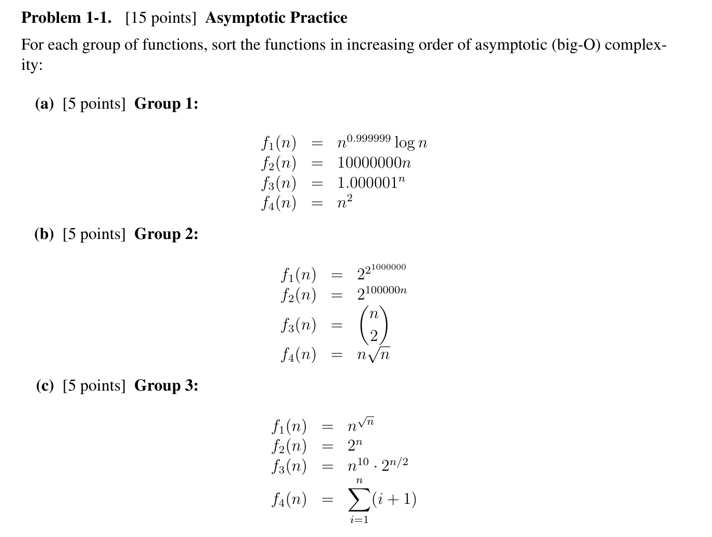
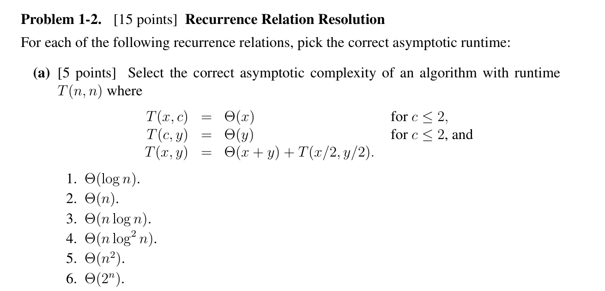
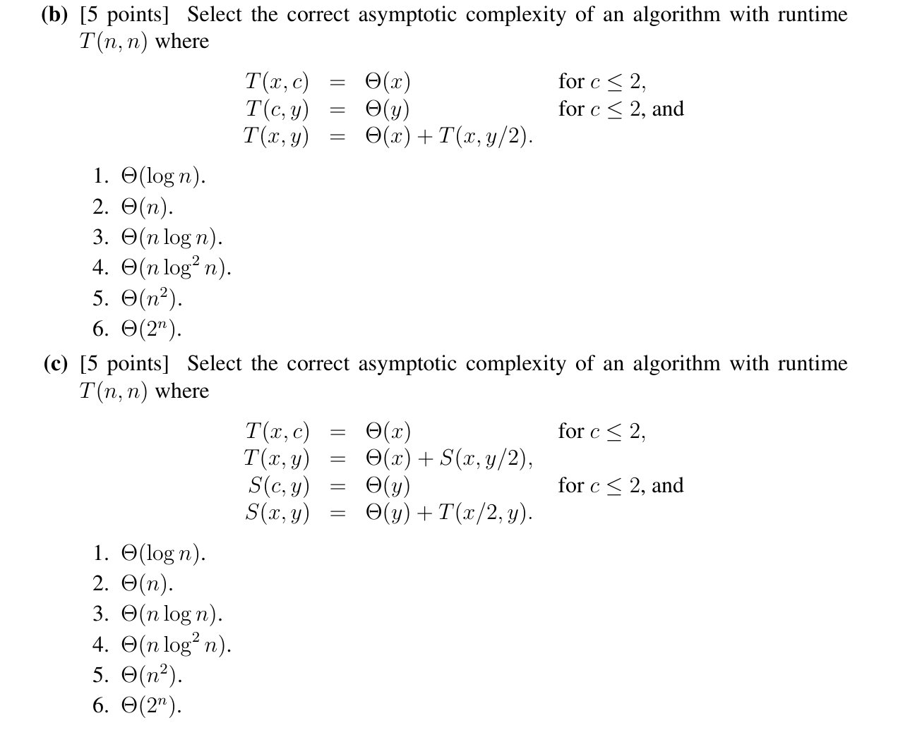

(a) $f_2 < f_1 < f_4 < f_3$
(b) $f_1 < f_4 < f_3 < f_2$
(c) $f_4 < f_1 < f_3 < f_2$

比较无穷大的阶即可

(a) $\Theta(n)$, 等比求和
(b) $\Theta(n\log n)$, $y$迭代$\log n$次, 每次时间复杂度为$\Theta (n)$.
(c) $\Theta(n)$, 注意到原式等价于$T(n, n) = \Theta (n) + T(n/2, n/2)$