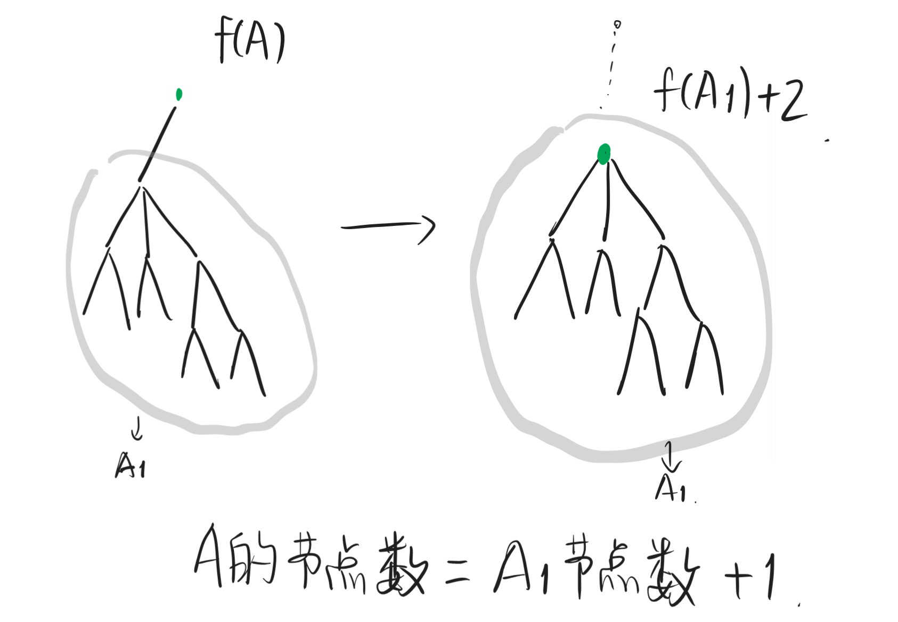
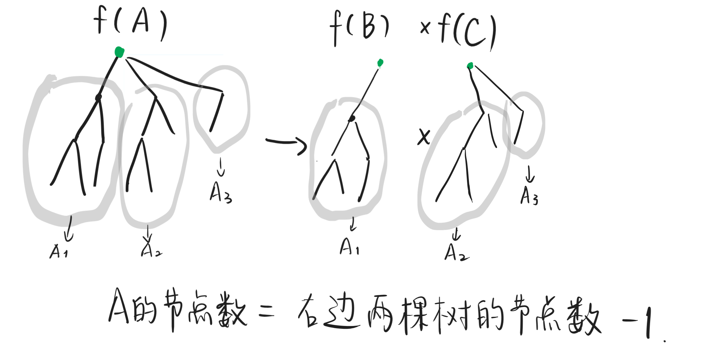

### 题意
给定一棵树, 这棵树的合法染色方案定义如下:
1. 某节点可以被涂成绿色, 蓝色, 黄色的其中一种
2. 树根为绿色.
3. 对于所有的蓝色和绿色节点, 它们之间两两可达, 不经过任何黄色节点.
4. 对于所有的黄色和绿色节点, 它们之间两两可达, 不经过任何蓝色节点.

现在, 给你一棵树(树未知)的合法染色方案数恰好为`m`, 求这棵树的最少节点数(若不存在输出`-1`).

### 题目分析
请注意题意中的第3. "对于所有的蓝色和绿色节点, 它们之间两两可达, 不经过任何黄色节点"意思是:
1. 蓝色节点和蓝色节点之间两两可达, 不经过任何黄色节点.
2. 蓝色结点和绿色节点之间两两可达, 不经过任何黄色节点.
3. **绿色节点和绿色节点之间两两可达, 不经过任何黄色节点**.

同样地, 由第4条我们会得到: **绿色节点和绿色节点之间两两可达, 不经过任何蓝色节点**. 所以说绿色和绿色之间**只能有绿色节点**. 这是这道题读题上的一个坑点(见样例3解释).

### 准备工作
我们首先考虑一个更简单的问题. 对于某个给定的树$A$, 我们如何求出这棵树的合法染色方案数呢? 假设$A$对应的染色方案数为$f(A)$, 则我们可以发现:
1. 树根的染色方案数为1.
2. 考察第一个孩子$a_1$和它管辖的子树$A_1$, 如果$a_1$染蓝色, 则整个子树$A_1$必须染成蓝色(因为绿色和绿色节点之间必须没有其他颜色). 如果$a_1$染黄色, 则整个子树$A_1$都必须染成黄色. 如果$a_1$染绿色: 这个子树$A_1$的染色方案数就是$f(A_1)$! 也就是说, 第一个子树的染色方案数为$f(A_1) + 2$.
3. 其他子树同理.
4. 各个子树之间互不影响, 由乘法原理, 得到
$$
f(A) = (f(A_1) + 2)(f(A_2) + 2)\cdots(f(A_k) + 2)
$$

### 正式开始
于是, 题目转化成了给定`m`, 求$f(A) = m$的所有树中节点数最小的树$A$.

我们假定这个$A$存在, 可以分两种情况考虑:
1. $A$只有一棵子树, 此时$f(A) = f(A_1) + 2 = m$, $|A| = |A_1| + 1$.(因为根节点被分出来了).
2. $A$有多棵子树, 我们可以把其中一棵分出来. $f(A) = (f(A_1) + 2)(f(A_2) + 2)...(f(A_k) + 2) = m$, 设$m = bc$, 则
$$
f(A_1) + 2 = b, (f(A_2) + 2)...(f(A_k) + 2) = c
$$
我们会发现这个式子右边恰好相当于一棵有着子树$A_2, A_3, ..., A_k$的树的合法染色方案数. 所以说我们成功地把$f(A)$分解成了两个树的合法染色数的积. $f(A) = f(B)f(C)$, 且$|A| = |B| + |C| - 1$.
如果很难理解的话, 看看下面这两张图.
第一种情况:


第二种情况:


题目要我们找到$f(A) = m$对应的节点数最小值, 我们可以递归地搜索$f(A_1) = m - 2$对应的节点数最小值$|A_1| + 1$, 和对于$m$的所有因数$b$来说, $f(B) = b$对应的节点数最小值加$f(C) = m / b$的节点数最小值$|B| + |C| - 1$. 然后取这两种结果中更小的那个即可.

加上记忆化搜索后, 状态空间的大小为$m$, 对于每个$m$需要分解因数, 用时大约为$\sqrt{m}$, 所以时间复杂度为$O(m\sqrt{m})$. 本题时限为4s, 足以通过.

### AC代码
使用记忆化搜索. 链接[提交记录](https://codeforces.com/contest/2112/submission/359138717)
```cpp
/*--------head files---------*/
// 此处省略大量模板定义, 见原链接.

/*---------variables---------*/
struct DP {
    ll dp[M];
    DP() {
        memset(dp, -1, sizeof(dp));
    }
    ll solve(int m) {
        if (m == 1) {
            return 1;
        } else if (m == 2) {
            return 0;
        }
        
        if (dp[m] != -1) {
            return dp[m];
        }
        
        ll ret = INFLL; // 1e18
        ret = min(ret, solve(m - 2) + 1);
        for (int i = 2; i <= m / i; i++) {
            if (m % i != 0) {
                continue;
            }
            ret = min(ret, solve(i) + solve(m / i) - 1);
        }
        dp[m] = ret;
        return ret;
    }
} dp;

/*---------functions---------*/

/*---------solutions---------*/
void preprocess() {}
void reset() {}
void solution() {
    /*code here*/
    ll m;
    cin >> m;
    if (m % 2 == 0) {
        cout << "-1\n";
        return;
    }
    cout << dp.solve(m) << '\n';
}
/*-----------main------------*/
int main() {
    int num_of_Task = 1;
    cin >> num_of_Task;
    preprocess();
    for (int _t = 1; _t <= num_of_Task; _t++) {
        #ifndef ONLINE_JUDGE
            cout << "test case " << _t << " :\n";
            cerr << "test case " << _t << " :\n";
        #endif
        reset();
        solution();
    }
}
/*--------by ykindred--------*/
```